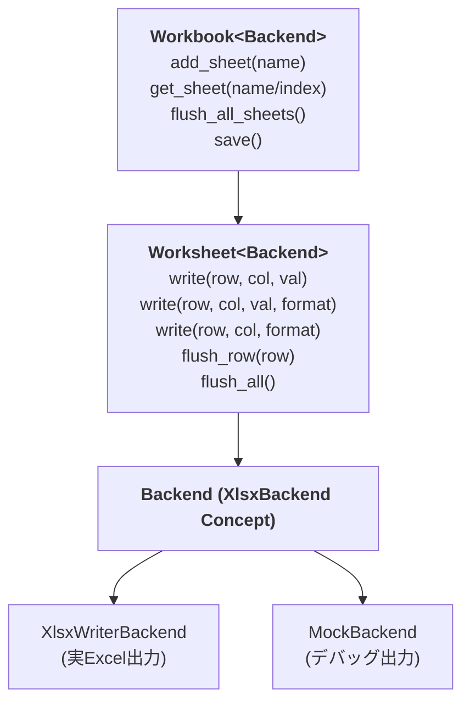

# xlsxwriterpp

**型安全・スパース遅延バッファ方式の `libxlsxwriter` C++26 ラッパーライブラリ。**

## 概要

`xlsxwriterpp` は C API である `libxlsxwriter` を現代的な C++26 の機能でラップし、型安全性・所有権の明確化・エラーハンドリングを提供するヘッダオンリーライブラリです。

### 特徴

- **型安全なセル値** — `CellValue = std::variant<std::monostate, int, double, std::string_view, bool>` により、型に応じた適切な書き込み関数を自動ディスパッチ
- **スパース遅延バッファ** — `write()` で内部バッファに格納し、`flush_row()` / `flush_all()` で初めてバックエンドに転送。行単位のフラッシュ制御が可能
- **書式マージ** — `write()` と `format()` を別々のタイミングで呼び、後から書式プロパティを部分的に上書き可能（`FormatProperties::merge()`）
- **並列書き込み対応** — ストライプロック方式（64 分割）により異なる行への並列アクセスを安全にサポート
- **MockBackend によるテスト容易性** — `XlsxBackend` コンセプトを満たすモックバックエンドを同梱。実際の Excel ファイルを生成せずにロジックの検証が可能
- **エラーハンドリング** — 全公開 API が `std::expected<T, XlsxError>` を返却。`RowOrderViolation`・`DuplicateSheetName` などのエラーを型安全に処理
- **C++20 Concepts による静的ポリモーフィズム** — `XlsxBackend` コンセプトにより、仮想関数テーブルを介さないコンパイル時ディスパッチ
- **ヘッダオンリー** — `INTERFACE` ライブラリとして提供。`target_link_libraries` で即利用可能

## 要件

- C++26 対応コンパイラ（GCC 14+, Clang 18+, MSVC 2022 17.12+）
- CMake 3.25+
- [libxlsxwriter](https://github.com/jmcnamara/libxlsxwriter)（v1.2+）
- テスト実行時: [Catch2](https://github.com/catchorg/Catch2) v3

## ビルド

```bash
# 依存関係のインストール（vcpkg 使用時）
vcpkg install libxlsxwriter catch2

# ビルド
cmake -B build -S . \
  -DCMAKE_TOOLCHAIN_FILE=<vcpkg_root>/scripts/buildsystems/vcpkg.cmake \
  -DBUILD_TEST=ON
cmake --build build

# テスト実行
ctest --test-dir build
```

## クイックスタート

```cpp
#include <xlsxwriterpp/workbook.hpp>
#include <xlsxwriterpp/xlsxwriter_backend.hpp>

auto main() -> int {
  // XlsxWriterBackend: 実際の Excel ファイルを出力
  auto wb = xlsxwriterpp::Workbook{
    xlsxwriterpp::XlsxWriterBackend{"output.xlsx"}};

  // シート追加
  auto* ws = wb.add_sheet("売上データ").value();

  // ヘッダー行
  ws->write(0, 0, std::string_view{"商品名"});
  ws->write(0, 1, std::string_view{"数量"});
  ws->write(0, 2, std::string_view{"単価"});

  // データ行
  ws->write(1, 0, std::string_view{"りんご"});
  ws->write(1, 1, 100);
  ws->write(1, 2, 150.0);

  // 行ごとにフラッシュ
  ws->flush_row(0);
  ws->flush_row(1);

  wb.save(); // output.xlsx が生成される
}
```

## 書式マージの例

`format()` を後から呼ぶことで、既存の書式を保持したまま一部プロパティのみを変更できます。

```cpp
// 値と太字・中央揃えを設定
ws->write(0, 0, std::string_view{"重要データ"});
ws->format(0, 0, FormatProperties{.bold = true, .h_align = HorizontalAlign::Center});

// 後から文字色だけを赤に変更（太字・中央揃えは維持）
ws->format(0, 0, FormatProperties{.font_color = 0xFF0000u});
```

## テスト用モックバックエンド

`MockBackend` を使用すると、実際の Excel ファイルを生成せずに動作検証ができます。

```cpp
#include <xlsxwriterpp/mock_backend.hpp>
#include <xlsxwriterpp/workbook.hpp>

auto wb = xlsxwriterpp::Workbook{xlsxwriterpp::MockBackend{}};
auto* ws = wb.add_sheet("Sheet1").value();
ws->write(0, 0, 42);
ws->flush_all();
wb.save(); // stdout に全操作がデバッグ出力される
```

## アーキテクチャ



### バックエンドシステム

- **`XlsxBackend` コンセプト** — `write_cell()`, `add_sheet()`, `save()` の 3 メソッドを要求。任意のバックエンド実装をテンプレートパラメータとして注入可能
- **`XlsxWriterBackend`** — `libxlsxwriter` を使用して実際の `.xlsx` ファイルを出力
- **`MockBackend`** — 全操作を `std::print` で標準出力に表示。テストやデバッグに利用

## プロジェクト構成


## ライセンス

MIT License. 詳細は [LICENSE](LICENSE) を参照。
